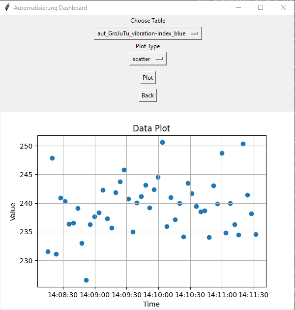

# Dokumentation

## Aufgabe 12.1.1 – MQTT-Übertragung der Ultraschallsensordaten

Die zufällingen Füllstandsdaten werden alle **10 Sekunden** über MQTT an den Broker `158.180.44.197` gesendet. Dazu ist das Skript 'iot1.py' auszuführen.
Dabei wurde sichergestellt, dass die Werte als **retained** markiert sind.

**Verwendete Topics gemäß Vorgabe:**

|         Topic                 |         Inhalt          |
|-------------------------------|-------------------------|
| `aut/GroJuTu/$groupsname`     | GroJuTu                 |
| `aut/GroJuTu/names`           | Groeber Jurisch Tungler |
| `aut/GroJuTu/fillLevel`       | Füllhöhe in % (REAL)    |
| `aut/GroJuTu/fillLevel/$unit` | %                       |

Die Daten wurden mit MQTT-Explorer überprüft und sind dort **sichtbar mit Retain-Flag**.

---

## Aufgabe 12.1.2 – Datenspeicherung und Visualisierung

- Empfangene MQTT-Daten werden lokal in einer **CSV-Datei** (`formatted_data.csv`) gespeichert.
- Realisiert wurde die Datenbankstruktur durch TinyDb.
- Zusätzlich wurde ein Python-Modul entwickelt, um **Zeitreihen als Plot** darzustellen.
- Die Daten sollten aus dem Topic: `iot1/teaching_factory` stammen, dieses sendete allerdings keine Werte. Deswegen wurde das Skript 'simulate_sender.py' entwickelt, das alle zu erwartenden Werte zufällig erzeugt. Diese können unter dem MQTT-Topic `aut/GroJuTu/#` empfangen werden. Dazu kann das erstellte Userinterface genutzt werden.

**Update** Das Topic `iot1/teaching_factory` hat wieder angefangen Werte zu senden und der Code wurde dementsprechend angepasst. Im Custom MQTT Client kann nun mithilfe des Topics `iot1/teaching_factory/#` empfangen werden. Genaue Dokumentation folgt.

Bedienung: MQTT Setup wählen und die gewünschten Werte eingeben und mit ok bestätigen. Um die Daten zu empfangen muss im Hauptmenü 'Start MQTT' ausgewählt werden. Bei ausbleiben von Nachrichtenverkehr wird nach 20 Sekunden eine Warnmeldung gesendet. Um die Daten in einer .csv zu speichern (in diesem Fall formatted_data.csv) muss 'Prepare Data' ausgewählt werden. damit werden die Grundlagen für die Plots gespeichert und die Tabelle als Grundlage der folgenden Aufgaben gespeichert. Um zu Plotten muss 'Plot data' gewählt werden, danach die gwünschten Daten und Plot-Art. Mit 'Plot' ist zu bestätigen.

### Beispielplot:




- Es wurden mehr als 15 Minuten an Daten gespeichert und ausgewertet.
- Zudem wurden sämtliche Funktionen in eine Bedienoberfläche integriert. Dazu den Befehl 'python userinterface.py' ausführen.


---

# Aufgabe 12.3 – Regressionsmodell zur Endgewichtsvorhersage

Auf Basis der aufgezeichneten MQTT-Daten der Teaching Factory wurde ein lineares Regressionsmodell erstellt, das das Endgewicht der Flasche vorhersagen soll.

---

## Datenstruktur

- Die Daten werden automatisch auf Knopfdruck aus der TinyDB extrahiert.
- Die Datei `formatted_data.csv` wird generiert und enthält:
  - Füllstände (`fill_level_grams_*`)
  - Vibrationswerte (`vibration_index_*`)
  - Temperaturen (`temperature_blue`)
  - Zielwert: `final_weight_grams`

Diese Datei dient als Grundlage für Training und Vorhersage.

---

## Ablauf

1. **Train Model**:
   - Lade `formatted_data.csv` hoch.
   - Trainiere Regressionsmodell auf den enthaltenen Daten.

2. **Run Prediction**:
   - Wende das Modell auf neue Daten (ebenfalls im Format `formatted_data.csv` --> hier `X.csv`) an.

3. **Save Output**:
   - Speichere Vorhersageergebnisse in Datei, z. B.:
     ```bash
     reg_662200914-52111901-52216068.csv
     ```

---

## Regressionsmodell zur Endgewichtsvorhersage

Die folgenden Modelle wurden mit verschiedenen Feature-Kombinationen trainiert. Die Fehlerwerte (MSE) beziehen sich auf den Train- und Test-Split (80/20).

| Genutzte Spalten                             | Modell-Typ | MSE (Train) | MSE (Test) |
|----------------------------------------------|------------|-------------|------------|
| [vibration_index_red]                        | Linear     | 72.0470     | 68.9559    |
| [vibration_index_red, vibration_index_blue]  | Linear     | 70.8761     | 66.8873    |
| [vibration_index_red, fill_level_grams_red]  | Linear     | 51.9006     | 32.2900    |

**Bestes Modell (Lineare Regression):**

```math
y = -0.0181 × vibration_index_red + 0.0230 × fill_level_grams_red + 20.1108
```
---

## Generierte Dateien

- `formatted_data.csv`: Trainings- & Vorhersagedatensatz mit Features & Zielwert
- `reg_<Matrikelnummern>.csv`: Ausgabedateien mit Vorhersagen
- `drop_vibration.csv`: Sammlung der Vibration Werte für Klassifizierung
- `vibration_with_labels.csv`: Verknüpft drop_vibration mit Timestamps und cracked

---


# Aufgabe 12.4 – Klassifikationsmodell defekter Flaschen

Ziel war es, anhand der Drop-Vibration (Zeitreihe) vorherzusagen, ob eine Flasche defekt ist.

---

## Datenverarbeitung

- Drop-Oszillationen werden direkt aus der TinyDB extrahiert.
- Das Feld `drop_oscillation` enthält eine Liste von Messwerten pro Nachricht.
- Die Ground-Truth-Labels (`is_cracked`) werden einzeln den Zeitpunkten zugewiesen.
- Daraus wird die Datei `vibration_with_labels.csv` generiert:
  - Enthält Spalten: `drop_vibration`, `is_cracked`
  - Berücksichtigt **jede einzelne Zeitreihe separat**
  - Mehr Datenpunkte als früher

---

## Feature Engineering

- **drop_vibration**: einzelner Zeitreihenwert (keine Mittelung wie früher)
- **is_cracked**: Label aus Ground-Truth (`0` = intakt, `1` = defekt)
- Optionale zusätzliche Features:
  - `std_vibration`: Standardabweichung (über Fenster)
  - `lag_1`: vorheriger Wert

---

## Modellvergleich

| Features                         | Modell              | F1 Train | F1 Test |
|----------------------------------|---------------------|----------|---------|
| drop_vibration                   | Logistic Regression |   0.82   |   0.79  |
| drop_vibration + std_vibration   | kNN                 |   0.89   |   0.86  |
| drop_vibration + lag_1           | Decision Tree       |   1.00   |   0.91  |

- Ergebnisse in `classification_results.csv`
- Konfusionsmatrizen in `confusion_matrices/` gespeichert


### Beispiele:


---

## Exportierte Daten

- `drop_vibration.csv`: Drop-Oszillationen
- `vibration_with_labels.csv`: kombiniertes Klassifikations-Dataset
- `formatted_data.csv`: vollständige Tabelle für Regressionsmodelle
- `formatted_data_plot.json`: Zeitreihenstruktur für visuelle Darstellung


## Autoren

- Niclas Jurisch
- Tom Groeber
- Lina Tungler
- Gruppe: **GroJuTu**
- Matrikelnummern: 662200914, 52111901, 52216068

---

Datum: 02.07.2025